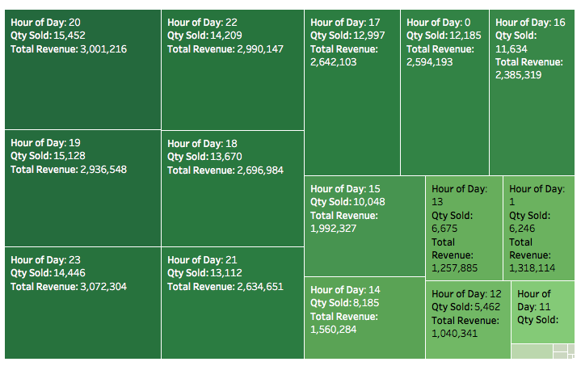
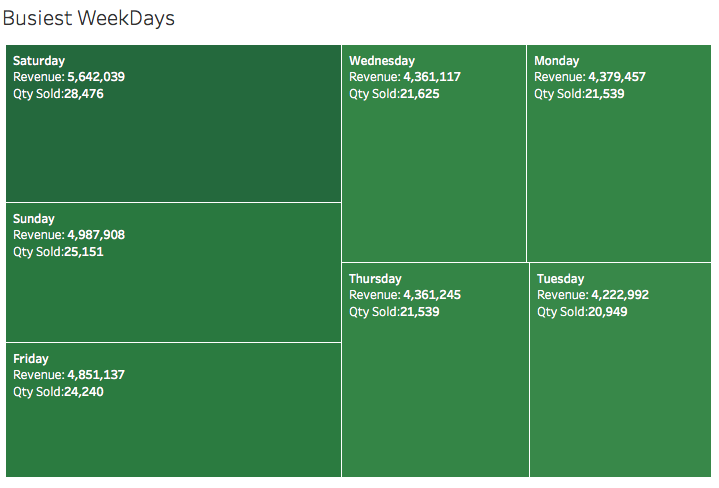
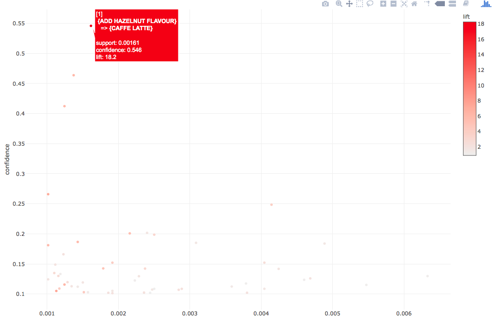
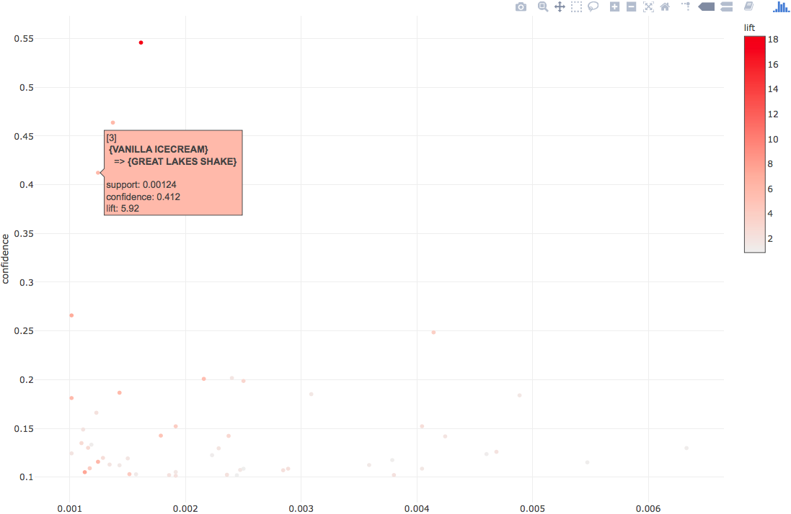
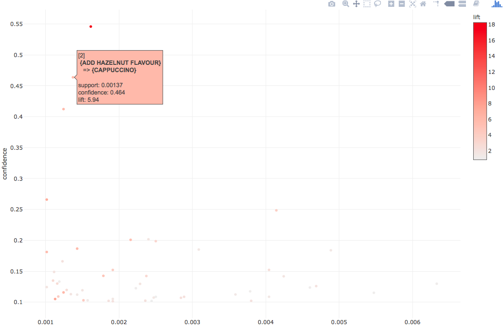
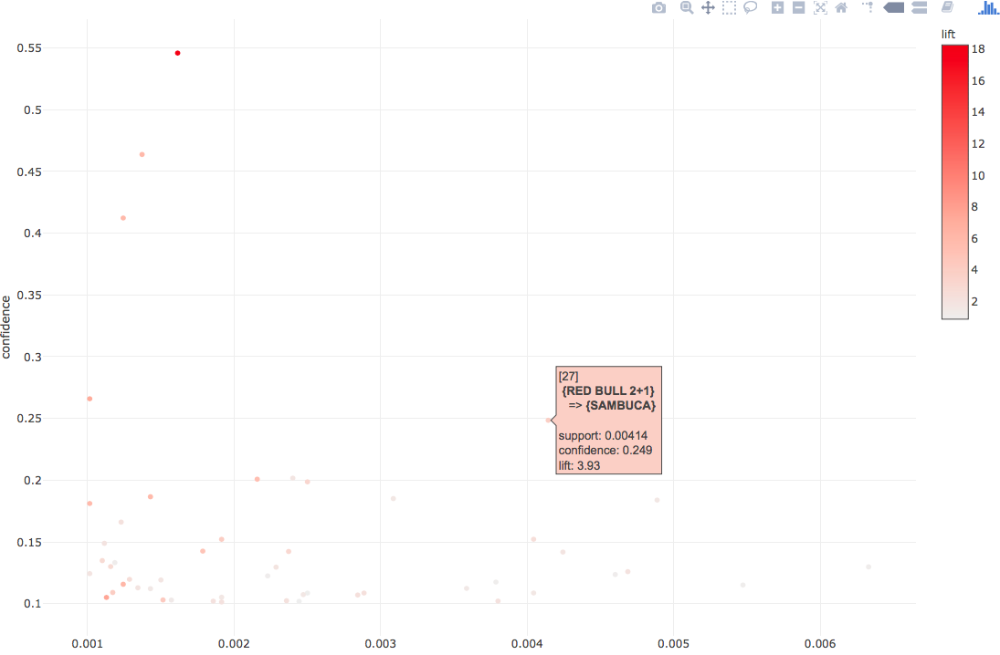

# Analysing POS data for Trends, Pricing and Menu changes

In this project, I analysed the point of sale transactional dataset to identify sales trends, suggest menu changes & impact of pricing changes.

## About the Data:
Data is collected from a café run by business students at a Midwestern public university. The data were collected over a ten-week period during the spring semester of 2010.
(More information about data collection)[http://jse.amstat.org/v19n1/depaolo.pdf]

## Tools Used:
Tableau & R

## Results:
Here is the presentation of detailed Analsis: 

#### Sales Trends

#### Products frequently purchased together

